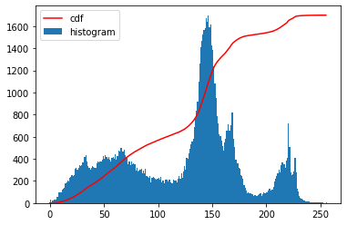
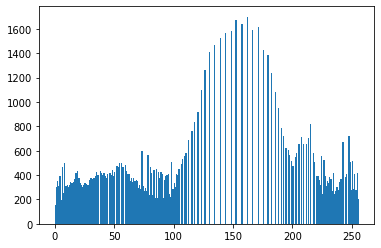

# 小作业二：直方图均衡化

一、实验要求

• 读入一幅灰度图像 • 进行直方图均衡化 •显示结果

二、算法原理

1.概念

直方图均衡化主要用于增强动态范围偏小的图像的反差。直方图均衡化借助灰度统计直方图和灰度累积直方图来进行。灰度统计直方图反映了图像中不同灰度级的像素的个数；灰度累积直方图反映了图像中灰度级小于或等于某值的像素的个数。基本思想是把原图像的直方图转换为均匀分布的形式，使图像的像素分布尽可能广泛，改善图像的对比度。

我们需要一个变换函数帮助我们把直方图映射到一个广泛分布的直方图中：


对灰度值的出现次数进行统计，计算累积分布函数值，为简化，累积分布函数值为0的灰度值被省略.

2.算法步骤

(1) 列出原始图像的灰度级$k，k=0,1,2,…,L-1，L$为灰度级的数量。图像为灰度图，所以位深度为8，故灰度级数共有$2^8 = 256$级数。

(2) 列出原始图像第$k$级灰度值的归一化表达形式$s_{k}$；

(3) 统计各灰度级的像素数目$n_{k}，k = 0,1,2,…,L-1$；

(4) 得到灰度统计直方图的归一化概率表达形式：$p_{s}\left(s_{k}\right)=n_{k} / N$；

(5) 基于累积分布函数计算灰度累积直方图：
$$
E\left(s_{k}\right)=\sum_{i=0}^{k} \frac{n_{i}}{N}=\sum_{i=0}^{k} p_{s}\left(s_{i}\right)
$$
(6) 进行取整扩展，计算映射后输出图像各灰度级对应灰度值的归一化表达形式：
$$
t_{k}={INT}\left((L-1) E\left(s_{k}\right)+0.5\right) / 255
$$
其中，$INT$为取整函数；

(7) 确定映射关系$s_{k} \rightarrow t_{k}$；

(8) 统计映射后各灰度级的像素数目$n_{k}$；

(9) 得到新的灰度统计直方图的归一化概率表达形式：$p_{t}\left(t_{k}\right)=n_{k} / N$，$N$为输出图像的像素数目，即原始图像的像素数目。

三、基本思路

首先我们可视化查看要处理的原图及对应的直方图：


计算累积分布函数的值并可视化：



编写直方图均衡化函数，输入是灰度图片

1.统计出图像的直方图。

```python
    # 灰度级
    L=256
    # 以灰度图像的方式读入图片
    img = cv2.imread(img, 0)
    h, w = img.shape
    # 计算图像的直方图，即存在的每个灰度值的像素点数量
    hist = cv2.calcHist([img], [0], None, [256], [0, 255])
    print(hist)
```

2.计算出各个灰度值像素的概率hist[i]，每个灰度值的个数除以所有像素点的个数，即归一化。

```python
    # 计算灰度值的像素点的概率，除以所有像素点个数，即归一化
    hist[0:255] = hist[0:255] / (h * w)
```

3.计算sumhist[i]，为前i个灰度值的分布概率hist[i]的总和。

```python
    # 设置累计分布函数Si
    sum_hist = np.zeros(hist.shape)
    # 开始计算Si的一部分值，注意i每增大，Si都是对前i个灰度值的分布概率进行累加
    for i in range(256):
        sum_hist[i] = sum(hist[0:i + 1])
    equal_hist = np.zeros(sum_hist.shape)
```

例: sumhist[4] = hist[1] + hist[2] + hist[3] + hist[4] ，即为累计分布函数

4.进行取整扩展，计算映射后输出图像各灰度级对应灰度值的归一化表达形式。对于新建立的sum_hist，要对其乘上（L-1），并且由于灰度值是整数，所以要对结果进行四舍五入。此时的数组存放的键值对，是对于每个原始图片的灰度值->处理之后的图片灰度值。

```python
    # 进行取整扩展
    for i in range(256):
        equal_hist[i] = int(((L - 1) - 0) * sum_hist[i] + 0.5)
    equal_img = img.copy()
```

5.将原图像各个灰度值转换，创建出新图像。

```python
    # 新图片的创建
    for i in range(h):
        for j in range(w):
            equal_img[i, j] = equal_hist[img[i, j]]

    equal_hist = cv2.calcHist([equal_img], [0], None, [256], [0, 256])
    equal_hist[0:255] = equal_hist[0:255] / (h * w)
    return equal_img
```

四、实验结果

输出直方图均衡化的图像如图所示。

处理后图像的灰度直方图为：



相对比于原图，图像的像素分布变得更加广泛，改善了图像的对比度。


参考资料

[(33条消息) 计算机视觉7-像素点直方图统计、掩膜图像_冲鸭！调参侠的博客-CSDN博客_img.ravel](https://blog.csdn.net/weixin_44738378/article/details/106586298)

[(32条消息) 数字图像处理之直方图均衡化（python）_小白学算法的博客-CSDN博客_图像直方图均衡化python](https://blog.csdn.net/hu_666666/article/details/127306483)

[(32条消息) python实现直方图均衡化_熬夜大学党的博客-CSDN博客_python直方图均衡化](https://blog.csdn.net/qq_46135040/article/details/122129872)

[(32条消息) 不调用python函数实现直方图均衡化_直方图均衡化(HE)_weixin_39714528的博客-CSDN博客](https://blog.csdn.net/weixin_39714528/article/details/111126196?spm=1001.2101.3001.6661.1&utm_medium=distribute.pc_relevant_t0.none-task-blog-2~default~CTRLIST~Rate-1-111126196-blog-111126192.pc_relevant_landingrelevant&depth_1-utm_source=distribute.pc_relevant_t0.none-task-blog-2~default~CTRLIST~Rate-1-111126196-blog-111126192.pc_relevant_landingrelevant&utm_relevant_index=1)