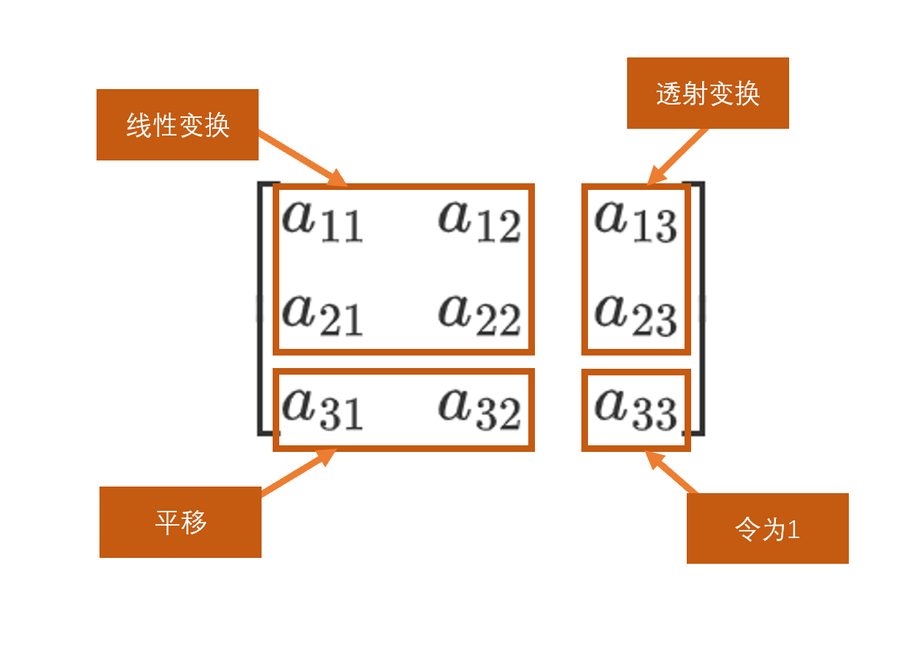
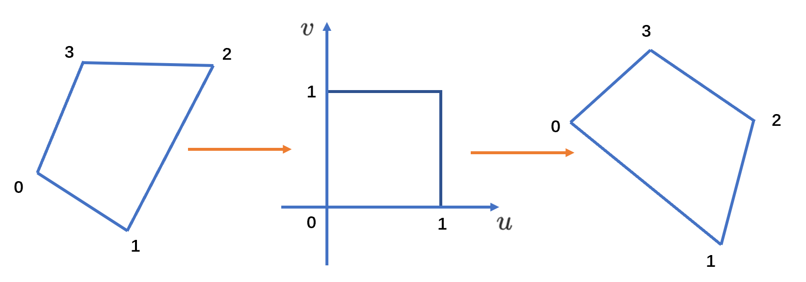

# 小作业一：图像透视变换

一、实验要求

读入一幅灰度图像，对图像进行透视变换，显示结果。

二、算法原理和基本思路

透视变换(Perspective Transformation)是指利用透视中心、像点、目标点三点共线的条件，按透视旋转定律使承影面(透视面)绕迹线(透视轴)旋转某一角度，破坏原有的投影光线束，仍能保持承影面上投影几何图形不变的变换。常用于对图像进行校准。

透视变换通用的变换公式：
$$
\left[\begin{array}{lll}
x^{\prime} & y^{\prime} & \omega^{\prime}
\end{array}\right]=\left[\begin{array}{lll}
u & v & 1
\end{array}\right]\left[\begin{array}{lll}
a_{11} & a_{12} & a_{13} \\
a_{21} & a_{22} & a_{23} \\
a_{31} & a_{32} & a_{33}
\end{array}\right]
$$
$u$ 和 $v$ 是原始图像坐标，通过透视变换后得到的图片坐标为$x$ , $y$ ，其中
$$
\begin{aligned}
 \\{x}& =\frac{{x}^{\prime}}{\omega^{\prime}}\\
{y} &=\frac{{y}^{\prime}}{\omega^{\prime}}
\end{aligned}
$$

这是一个从二维空间变换到三维空间的转换，因为图像在二维平面，故除以 $\omega^{\prime}$.

变换矩阵可以拆分为四部分：

重写之前的变换公式可以得到：
$$
\begin{array}{l}
x=\frac{x^{\prime}}{w^{\prime}}=\frac{a_{11} u+a_{21} v+a_{31}}{a_{13} u+a_{23} v+1} \\
y=\frac{y^{\prime}}{w^{\prime}}=\frac{a_{12} u+a_{22} v+a_{32}}{a_{13} u+a_{23} v+1}
\end{array}
$$
所以，已知变换对应的几个点就可以求取变换公式，特定的变换公式也能产生新的变换后的图片。简单的看一个正方形到四边形的变换。
变换的4组对应点可以表示成：$(0,0) \rightarrow\left(x_{0}, y_{0}\right),(1,0) \rightarrow\left(x_{1}, y_{1}\right),(1,1) \rightarrow\left(x_{2}, y_{2}\right),(0,1) \rightarrow\left(x_{3}, y_{3}\right)$

根据变换公式得到：
$$
\begin{aligned}
a_{31} &=x_{0} \\
a_{11}+a_{31}-a_{13} x_{1} &=x_{1} \\
a_{11}+a_{21}+a_{31}-a_{13} x_{2}-a_{23} x_{2} &=x_{2} \\
a_{21}+a_{31}-a_{23} x_{3} &=x_{3} \\
a_{32} &=y_{0} \\
a_{12}+a_{32}-a_{13} y_{1} &=y_{1} \\
a_{12}+a_{22}+a_{32}-a_{23} y_{2}-a_{23} y_{2} &=y_{2} \\
a_{22}+a_{32}-a_{23} y_{3} &=y_{3}
\end{aligned}
$$
定义几个辅助变量：
$$
\begin{array}{lll}
\Delta x_{1}=x_{1}-x_{2} & \Delta x_{2}=x_{3}-x_{2} & \Delta x_{3}=x_{0}-x_{1}+x_{2}-x_{3} \\
\Delta y_{1}=y_{1}-y_{2} & \Delta y_{2}=y_{3}-y_{2} & \Delta y_{3}=y_{0}-y_{1}+y_{2}-y_{3}
\end{array}
$$
$\Delta x_{3},\Delta y_{3}$都为0时变换平面与原来是平行的，可以得到：
$$
\begin{array}{l}
a_{11}=x_{1}-x_{0} \\
a_{21}=x_{2}-x_{1} \\
a_{31}=x_{0} \\
a_{12}=y_{1}-y_{0} \\
a_{22}=y_{2}-y_{1} \\
a_{32}=y_{0} \\
a_{13}=0 \\
a_{12}=0
\end{array}
$$
$\Delta x_{3},\Delta y_{3}$不为0时，得到：
$$
\begin{aligned}
a_{11} &=x_{1}-x_{0}+a_{12} x_{1} \\
a_{21} &=x_{3}-x_{0}+a_{12} x_{2} \\
a_{31} &=x_{0} \\
a_{12} &=y_{1}-y_{0}+a_{13} y_{1} \\
a_{22} &=y_{3}-y_{0}+a_{23} y_{3} \\
a_{32} &=y_{0} \\
a_{13} &=\left|\begin{array}{ll}
\Delta x_{3} & \Delta x_{2} \\
\Delta y_{3} & \Delta y_{2}
\end{array}\right| /\left|\begin{array}{ll}
\Delta x_{1} & \Delta x_{2} \\
\Delta y_{1} & \Delta y_{2}
\end{array}\right| \\
a_{12} &=\left|\begin{array}{ll}
\Delta x_{1} & \Delta x_{3} \\
\Delta y_{1} & \Delta y_{3}
\end{array}\right| /\left|\begin{array}{ll}
\Delta x_{1} & \Delta x_{2} \\
\Delta y_{1} & \Delta y_{2}
\end{array}\right|
\end{aligned}
$$
求解出的变换矩阵就可以将一个正方形变换到四边形。反之，四边形变换到正方形也是一样的。于是，我们通过两次变换：四边形变换到正方形+正方形变换到四边形就可以将任意一个四边形变换到另一个四边形。

三、实验结果

在原图上截取一块区域进行透视变换，得到的输出图像如下。

参考资料：

[(32条消息) 一文弄懂numpy数组_罗罗攀的博客-CSDN博客](https://blog.csdn.net/luoluopan/article/details/126357310)

[【Python基础】Python中读取图片的6种方式_51CTO博客_python 读取图片](https://blog.51cto.com/u_15671528/5526474)

[(32条消息) 【图像处理】透视变换 Perspective Transformation_xiaowei_cqu的博客-CSDN博客_透视变换](https://blog.csdn.net/xiaowei_cqu/article/details/26471527)